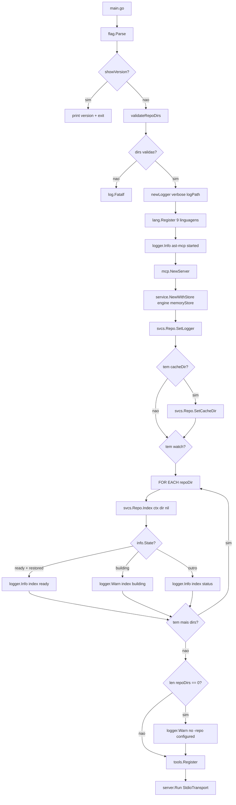
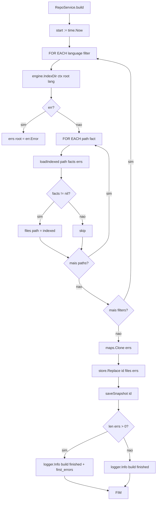
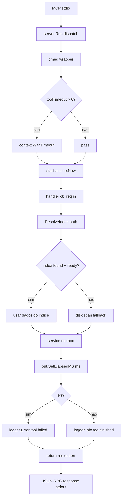
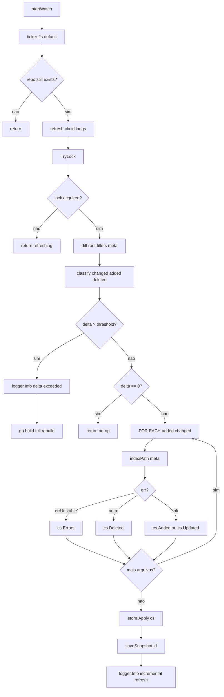
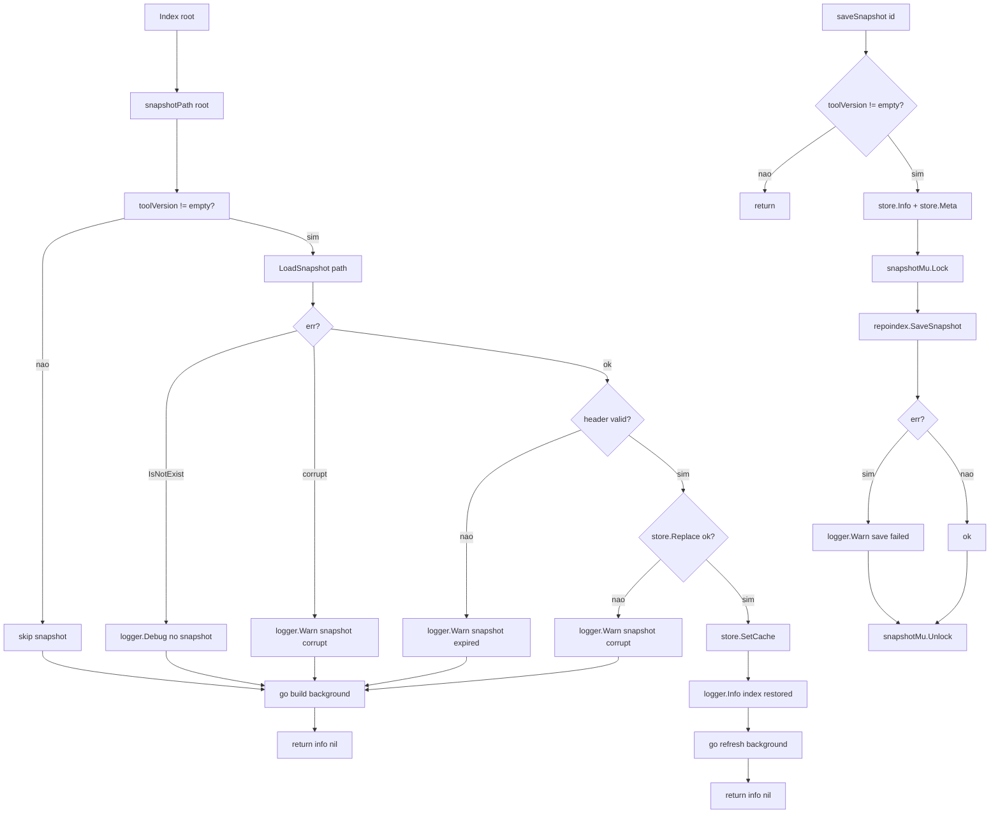

# Diagrama de Fluxo — mcp-ast

Fluxos completos do servidor MCP com indexação de repositório.

---

## 1. Boot Flow

---

## 2. Index Build Flow (background goroutine)

---

## 3. Tool Call Flow

---

## 4. Refresh Flow (watcher polling)

---

## 5. Snapshot Flow

---

## 6. Path Resolution Flow

```mermaid
flowchart TD
    A[ResolveIndex path] --> B[filepath.Abs path]
    B --> C[filepath.Clean abs]
    C --> D[bestRoot = empty]
    D --> E[FOR EACH root in roots]
    E --> F{abs == root OR hasPrefix?}
    F -- sim --> G{len root > len bestRoot?}
    G -- sim --> H[bestRoot = root, bestID = id]
    G -- nao --> I[skip]
    F -- nao --> I
    H --> E
    I --> E
    E --> J{bestID == empty?}
    J -- sim --> K[return empty false]
    J -- nao --> L[store.Info bestID]
    L --> M{ok AND state == ready?}
    M -- sim --> N[return info true]
    M -- nao --> O[return empty false]
```

---

## Legenda

| Elemento | Significado |
|----------|-------------|
| `flag.Parse` | CLI parse das flags `-repo`, `-verbose`, `-log`, etc. |
| `store.Replace` | Publica o índice via RWMutex (state → ready) |
| `saveSnapshot` | Escrita atômica do snapshot em disco (gob) |
| `ResolveIndex` | Maior prefixo entre roots registrados |
| `timed` | Wrapper de timeout + elapsed_ms + logging |
| `TryLock` | Coalescing de refreshes concorrentes |
| `diff` | Compara filesystem vs meta (size + mtime) |
| `threshold` | max(500, 20% do total) — delta maior → rebuild |
